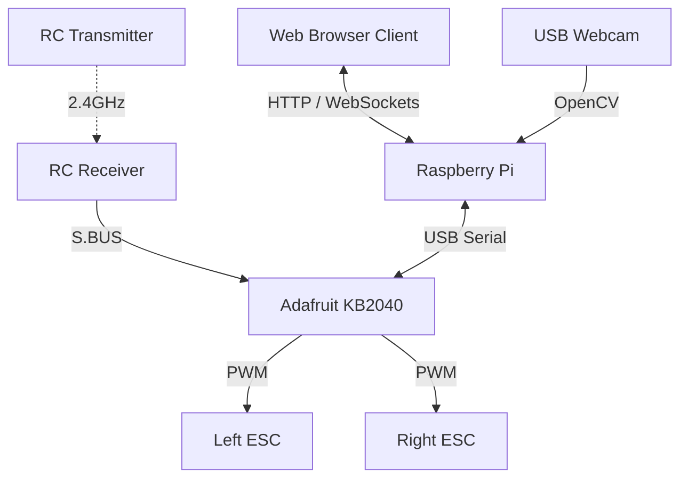

# Overlander-4 Web Controller

A remote control console and web operator interface for the goBILDA Overlander-4 mobile rover, featuring a live low-latency webcam feed, web-based joystick drive, and hardware-level RC transmitter override safety fallback.

## System Architecture

The control system consists of two main hardware units communicating over USB Serial:
1. **Raspberry Pi**: Hosts the web server, handles the USB webcam video capture/compression, serves the web interface, and translates joystick movements into differential drive commands sent to the microcontroller.
2. **Adafruit KB2040 (CircuitPython)**: Operates the low-level real-time kinematics and safety tasks. It parses S.BUS packets from the RC receiver, coordinates the active control mode (Web vs. RC manual override), and outputs 50Hz PWM signals to the Electronic Speed Controllers (ESCs).



---

## Wiring & Pinout Reference

> [!IMPORTANT]
> To protect the Raspberry Pi USB port from damage due to back-powering, isolate the ESC BEC 6.2V power from the KB2040 VBUS (5V USB) by de-pinning the red power wire from the ESC signal connectors.

| KB2040 Silk Pin | Connection Target | Wire Color | Purpose |
|:---|:---|:---|:---|
| **Pin 3** | Receiver M.BUS / S.BUS Output | Yellow | S.BUS input signal (inverted UART) |
| **Pin 4** | Left Motor ESC Signal (PWM) | White | PWM Output (Motor 1) |
| **Pin 7** | Right Motor ESC Signal (PWM) | White | PWM Output (Motor 2) |
| **GND** | Receiver Ground / ESC Ground | Green / Black | Common ground reference |

---

## Repository Structure

* `firmware/code.py`: CircuitPython 9.0.5 script running on the Adafruit KB2040. Handles sliding-window S.BUS packet decoding, serial heartbeats, NeoPixel status, and PWM output.
* `server/rover_web_control.py`: Python web controller server running on the Raspberry Pi. Hosts the ThreadingHTTPServer, streams OpenCV MJPEG frames, and translates joystick coordinates.
* `host_tools/`: Helper scripts running on the host machine to deploy the firmware/code files and manage the server remotely over SSH.

---

## Installation & Deployment

### 1. Firmware Deployment
Deploy `firmware/code.py` to the Adafruit KB2040's `CIRCUITPY` drive:
```bash
python host_tools/deploy_firmware.py
```

### 2. Web Server Deployment
Upload the web control script to the Raspberry Pi:
```bash
python host_tools/deploy_web_control.py
```

### 3. Running the Server
Restart the server process on the Pi:
```bash
python host_tools/start_web_control.py
```
Once started, open your browser and navigate to the Pi's console:
`http://192.168.0.130:8080`

---

## Operation & Modes

The KB2040 parses **Channel 5** of the S.BUS transmitter to switch control modes:
* **RC Override (Transmitter Channel 5 HIGH)**: NeoPixel turns **Solid Blue**. The rover is driven directly using the RC transmitter stick controls.
* **Web Control (Transmitter Channel 5 LOW)**: NeoPixel turns **Solid Green** (or flashes green if idle). The rover accepts commands from the web joystick interface. If the web client stops sending heartbeats for > 1.0s, the rover safely stops.
* **Failsafe Mode**: If S.BUS signal is lost entirely, the NeoPixel flashes **Red** and the motors stop.
